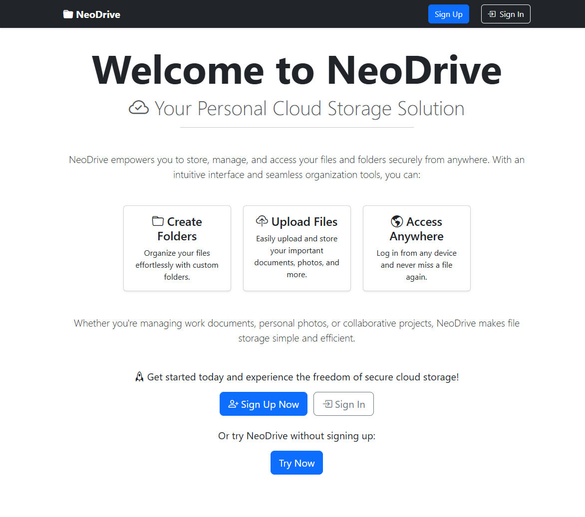

# 📁 File Uploader Project "NeoDrive"

This is a project from "The Odin Project" web development course. It is a comprehensive cloud-based storage application that allows users to upload, manage, and retrieve files efficiently, similar to Google Drive.

## ✨ Features

- 🔒 User authentication and authorization using sessions
- 📤 File upload and storage
- 📁 File retrieval and management
- 📱 Responsive design

## 🌐 Deployment

Try out the web app with the following link: [NeoDrive](https://example.com)

## 🛠️ Libraries and Tools Used

- **Prisma**: An ORM (Object-Relational Mapping) tool used for database management and migrations.
- **Jest**: A testing framework used to ensure the application has good test coverage and functions as expected.
- **Supertest**: A library used for testing HTTP endpoints.
- **Express**: A web application framework for Node.js, used to build the server-side logic.
- **Multer**: A middleware for handling `multipart/form-data`, which is used for uploading files.
- **bcrypt**: A library to help hash passwords.
- **Supabase**: A backend-as-a-service platform used for database management and authentication.
- **Passport**: A middleware for handling user authentication.
- **Bootstrap**: A CSS framework used for styling the application.

## 🧪 Testing

The project includes a comprehensive suite of tests written using Jest and Supertest. These tests cover various aspects of the application, including:

- ✅ Unit tests for individual functions and modules
- 🔗 Integration tests for ensuring different parts of the application work together correctly
- 🌐 End-to-end tests to simulate real user interactions and verify the overall functionality

The tests ensure that the application maintains high reliability and performance standards.

## 📸 Screenshots

Here are some screenshots of the application:


*Login Page*


*File Upload*

## 🚀 How to run

To get started with the project, follow these steps:

1. Clone the repository:
    ```bash
    git clone https://github.com/yourusername/file-uploader.git
    ```
2. Install the dependencies:
    ```bash
    cd file-uploader
    npm install
    ```
3. Set up the environment variables:
    ```bash
    cp .env.example .env
    ```
4. Run the database migrations:
    ```bash
    npx prisma migrate dev
    ```
5. Start the development server:
    ```bash
    npm run dev
    ```
